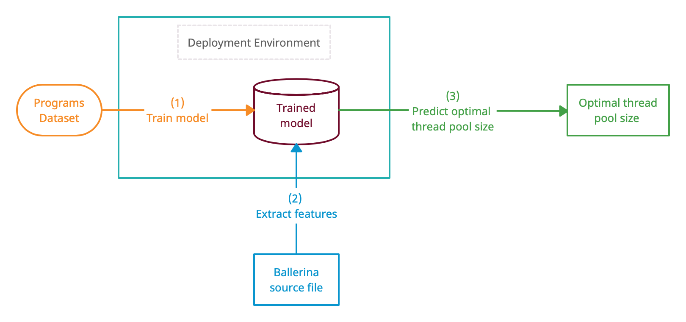

# Machine Learning Based Thread Pool Tuning via Program Analysis
By Lakindu Akash, Duneesha Fernando, Malith Jayasinghe, Chamath Keppitiyagama and Kishanthan Thangarajah

## Brief Introduction
We propose a novel approach which predicts the optimal thread pool size for a given Ballerina integration program during
compile time. Optimal thread pool size is the thread pool size at which the minimum latency is obtained for a given 
integration program. As shown in the below figure, first of all execute the 72 Ballerina integration
programs of the Programs Dataset in the deployment environment. Then obtain the optimal thread pool 
size for each integration program. Next, train the ML model/s with the features of those programs against the optimal 
thread pool size. During deployment, you may want to predict the optimal thread pool size for a new Ballerina program.
There, first parse the AST of the Ballerina program using the AST parser that we have developed. Input the features 
returned by the AST parser to the pre-trained ML model/s and update the BALLERINA_MAX_POOL_SIZE variable with the 
optimal thread pool size suggested by the ML model.

Thereafter, when you execute your integration program, you will experience a lower latency than when Ballerina's default
thread pool size is used.

### Structure of this repository
- programs-dataset
    - Contains the source-code files of Ballerina programs used to create the Programs Dataset. 
	- Contains the architecture for conducting tests (with proper resource isolation)
	- Contains the results of experiments
- preprocessed-dataset
	- Contains the AST parser logic
	- Contains the input dataset for ML models
- ml-models 
    - Contains the final implementation of ML models used during final evaluation

