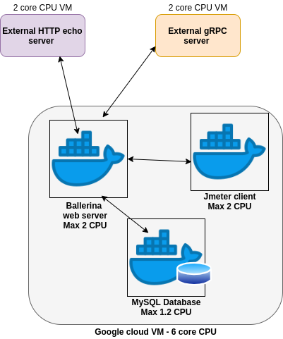

Execute the Ballerina integration programs included in this directory following the 
architecture given below. The following architecture of the test environment depicts how the
resources should be isolated. All services (Ballerina main service, HTTP service, 
Database service & the gRPC servers) and clients (Jmeter) should be containerized. 

In order to mimic real world scenarios we have kept the Ballerina web server, Jmeter client and 
MySQL Database server in one VM, while the HTTP echo server and gRPC server were deployed externally
in separate VMs. When deploying multiple services in a single VM, dockerization is very important. 
Also remember to specify the maximum resource limits (CPU and memory) for all service containers. 

